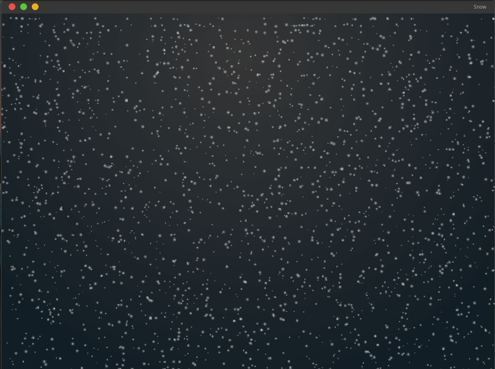

<h1>Snowy Screensaver</h1>

<h2>installing</h2>

!!! To work you need to install sfml !!!

~~~
git clone https://github.com/night3098/SnowyScreensaver
cd SnowyScreensaver
g++ SnowyScreensaver.cpp -o screensaver -lsfml-graphics -lsfml-window -lsfml-system
./screensaver
~~~

Press "n" to switch to night or day mode
